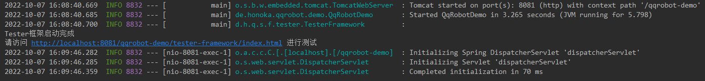
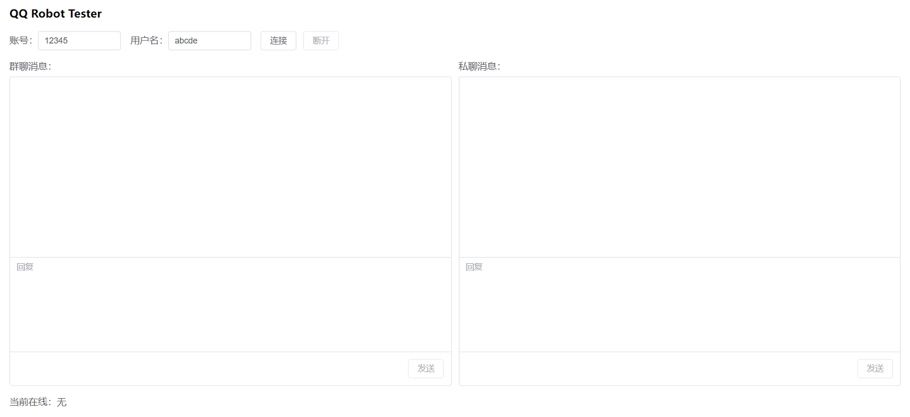
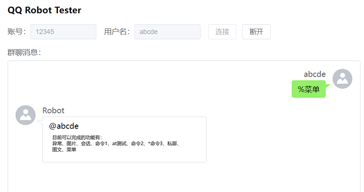
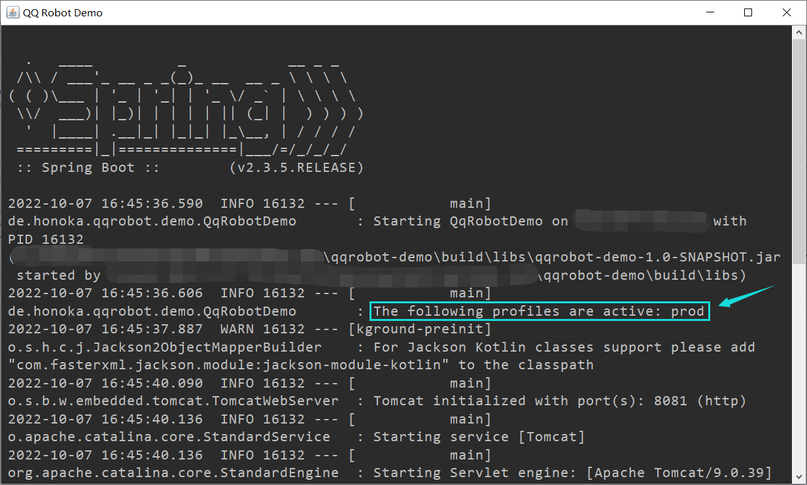

# QQ Robot Framework
![Java](https://img.shields.io/badge/Java-8-brightgreen?logo=data:image/svg+xml;base64,PD94bWwgdmVyc2lvbj0iMS4wIiBzdGFuZGFsb25lPSJubyI/Pg0KPCFET0NUWVBFIHN2ZyBQVUJMSUMgIi0vL1czQy8vRFREIFNWRyAxLjEvL0VOIiAiaHR0cDovL3d3dy53My5vcmcvR3JhcGhpY3MvU1ZHLzEuMS9EVEQvc3ZnMTEuZHRkIj4NCjxzdmcgdD0iMTY1MTk1MjU3MzQyOCIgY2xhc3M9Imljb24iIHZpZXdCb3g9IjAgMCAxMDI0IDEwMjQiIHZlcnNpb249IjEuMSIgeG1sbnM9Imh0dHA6Ly93d3cudzMub3JnLzIwMDAvc3ZnIiBwLWlkPSI4NDAiIHdpZHRoPSI2NCIgaGVpZ2h0PSI2NCIgeG1sbnM6eGxpbms9Imh0dHA6Ly93d3cudzMub3JnLzE5OTkveGxpbmsiPg0KICAgIDxyZWN0IHdpZHRoPSIxMDAlIiBoZWlnaHQ9IjEwMCUiIGZpbGw9IndoaXRlIiAvPg0KICAgIDxwYXRoIGQ9Ik01NTguMDggNDcyLjA2NGM0OC4xMjggNTMuMjQ4LTEzLjMxMiAxMDMuNDI0LTEzLjMxMiAxMDMuNDI0czExOS44MDgtNjEuNDQgNjUuNTM2LTEzOS4yNjRjLTUxLjItNzEuNjgtOTEuMTM2LTEwNy41MiAxMjIuODgtMjMyLjQ0OCAwIDEuMDI0LTMzNS44NzIgODYuMDE2LTE3NS4xMDQgMjY4LjI4OCIgZmlsbD0iI0ZGMDAwMCIgcC1pZD0iODQxIj48L3BhdGg+DQogICAgPHBhdGggZD0iTTYxMC4zMDQgNS4xMnMxMDEuMzc2IDEwMS4zNzYtOTYuMjU2IDI1OC4wNDhDMzU2LjM1MiAzODkuMTIgNDc4LjIwOCA0NjAuOCA1MTQuMDQ4IDU0My43NDQgNDIwLjg2NCA0NTkuNzc2IDM1NC4zMDQgMzg2LjA0OCAzOTkuMzYgMzE3LjQ0IDQ2My44NzIgMjE2LjA2NCA2NTEuMjY0IDE2Ni45MTIgNjEwLjMwNCA1LjEyIiBmaWxsPSIjRkYwMDAwIiBwLWlkPSI4NDIiPjwvcGF0aD4NCiAgICA8cGF0aCBkPSJNNzIwLjg5NiA3NTcuNzZjMTgzLjI5Ni05NS4yMzIgOTguMzA0LTE4OC40MTYgMzkuOTM2LTE3NS4xMDQtMTUuMzYgMy4wNzItMjEuNTA0IDUuMTItMjEuNTA0IDUuMTJzNS4xMi04LjE5MiAxNi4zODQtMTEuMjY0YzExNy43Ni00MC45NiAyMDcuODcyIDEyMC44MzItMzcuODg4IDE4Ni4zNjgtMS4wMjQgMCAyLjA0OC0zLjA3MiAzLjA3Mi01LjEybS0zMzcuOTIgMzguOTEycy0zNy44ODggMjEuNTA0IDI2LjYyNCAyOS42OTZjNzYuOCA4LjE5MiAxMTcuNzYgOC4xOTIgMjAyLjc1Mi04LjE5MiAwIDAgMjMuNTUyIDE1LjM2IDUzLjI0OCAyNi42MjQtMTkxLjQ4OCA4MC44OTYtNDMzLjE1Mi01LjEyLTI4Mi42MjQtNDguMTI4bS0yMy41NTItMTA2LjQ5NnMtNDMuMDA4IDMxLjc0NCAyMy41NTIgMzcuODg4YzgyLjk0NCA4LjE5MiAxNDkuNTA0IDEwLjI0IDI2MS4xMi0xMy4zMTIgMCAwIDE2LjM4NCAxNi4zODQgNDAuOTYgMjQuNTc2LTIzMS40MjQgNjguNjA4LTQ5MC40OTYgNS4xMi0zMjUuNjMyLTQ5LjE1MiIgZmlsbD0iIzY2OTlGRiIgcC1pZD0iODQzIj48L3BhdGg+DQogICAgPHBhdGggZD0iTTgxMS4wMDggODc2LjU0NHMyNy42NDggMjMuNTUyLTMxLjc0NCA0MC45NmMtMTExLjYxNiAzNC44MTYtNDYwLjggNDUuMDU2LTU1OC4wOCAyLjA0OC0zNC44MTYtMTUuMzYgMzEuNzQ0LTM1Ljg0IDUxLjItNDAuOTYgMjEuNTA0LTUuMTIgMzQuODE2LTMuMDcyIDM0LjgxNi0zLjA3Mi0zOC45MTItMjguNjcyLTI1MS45MDQgNTIuMjI0LTEwNy41MiA3NS43NzYgMzkwLjE0NCA2Mi40NjQgNzEyLjcwNC0yOC42NzIgNjExLjMyOC03NC43NTJNNDAwLjM4NCA1NzguNTZzLTE3OC4xNzYgNDMuMDA4LTYzLjQ4OCA1Ni4zMmM0OS4xNTIgNi4xNDQgMTQ2LjQzMiA1LjEyIDIzNS41Mi0zLjA3MiA3My43MjgtNi4xNDQgMTQ3LjQ1Ni0xOS40NTYgMTQ3LjQ1Ni0xOS40NTZzLTI2LjYyNCAxMS4yNjQtNDUuMDU2IDI0LjU3NmMtMTgxLjI0OCA0OC4xMjgtNTMwLjQzMiAyNi42MjQtNDMwLjA4LTIzLjU1MiA4OC4wNjQtMzkuOTM2IDE1NS42NDgtMzQuODE2IDE1NS42NDgtMzQuODE2IiBmaWxsPSIjNjY5OUZGIiBwLWlkPSI4NDQiPjwvcGF0aD4NCiAgICA8cGF0aCBkPSJNNDE4LjgxNiAxMDE1LjgwOGMxNzYuMTI4IDExLjI2NCA0NDYuNDY0LTYuMTQ0IDQ1My42MzItOTAuMTEyIDAgMC0xMy4zMTIgMzEuNzQ0LTE0Ni40MzIgNTYuMzItMTUwLjUyOCAyNy42NDgtMzM2Ljg5NiAyNC41NzYtNDQ2LjQ2NCA2LjE0NCAyLjA0OCAxLjAyNCAyNC41NzYgMjAuNDggMTM5LjI2NCAyNy42NDgiIGZpbGw9IiM2Njk5RkYiIHAtaWQ9Ijg0NSI+PC9wYXRoPg0KPC9zdmc+)
<br />
[](./LICENSE)

[](../../releases)

## 简介
本项目是一款Spring Boot平台一站式QQ机器人开发框架，其对QQ机器人开发过程中遇到的许多常见问题提供了便利的解决方案，能够快速、高效、便捷地搭建基于Spring Boot平台的QQ机器人。

其特性包含自动化命令匹配、命令权限校验、命令参数提取、便利的持续会话实现、调用日志与异常日志等。同时还包含了便捷的测试框架以及后台管理界面。

本项目采用Apache-2.0 License，使用本项目时，请遵守此开源许可证的相关规定。

请参阅：[开发文档](./docs/development.md)&emsp;[更新日志](./docs/changelog.md)&emsp;[Tester框架说明文档](./docs/tester-framework.md)

## 使用
本项目部署于：

[](https://github.com/kosaka-bun/maven-repo)

使用前请先阅读此仓库的文档，为你的Maven或Gradle添加依赖仓库。

各模块版本号请前往[Releases](../../releases)查看。

### Maven
```xml
<dependencies>
    <dependency>
        <groupId>de.honoka.qqrobot</groupId>
        <artifactId>qqrobot-spring-boot-starter</artifactId>
        <version>版本号</version>
    </dependency>
</dependencies>
```

### Gradle
```groovy
dependencies {
    implementation 'de.honoka.qqrobot:qqrobot-spring-boot-starter:版本号'
}
```

## 快速开始
[qqrobot-demo](./qqrobot-demo)是基于本框架搭建的一个示例程序，其包含了本框架的所有基本用法示例。请先按步骤分别尝试在测试环境与正式环境中尝试运行此Demo应用。

### 测试环境
1. clone本仓库。
2. 使用IDE打开qqrobot-demo目录（非仓库根目录）。
3. 运行qqrobot-demo的Spring Boot主类[QqRobotDemo](./qqrobot-demo/src/main/java/de/honoka/qqrobot/demo/QqRobotDemo.java)。
4. 等待应用启动完成，打开测试框架界面，默认为[http://localhost:8081/qqrobot-demo/tester-framework/index.html](http://localhost:8081/qqrobot-demo/tester-framework/index.html)。




5. 点击“连接”，然后在群聊消息对应的输入框中输入“%菜单”，若得到回复，则测试环境运行成功。



### 正式环境
1. 在qqrobot-demo目录下，执行`gradlew bootJar`命令，等待构建完成。
2. 将[qqrobot-demo/src/main/resources/config/application-prod.yml](./qqrobot-demo/src/main/resources/config/application-prod.yml)文件，复制到qqrobot-demo/build/libs目录下。
3. 打开libs目录下的application-prod.yml文件，修改`honoka.qqrobot`项下的`qq`、`password`、`admin-qq`、`developing-group`四个配置项，指定机器人要使用的QQ账号、密码、可调用管理员命令的用户的QQ账号，以及开发群的群号。
4. 在libs目录下创建`startup.bat`（Windows）或`startup.sh`（Linux）文件，插入以下内容。
```shell
javaw -jar -Dfile.encoding=UTF-8 -Dspring.profiles.active=prod [jar包的名称]
```
5. 执行`startup.bat`或`startup.sh`文件，等待应用启动完成，注意留意jar包是否启用了prod配置文件。



6. 通过任何方式向机器人所登录QQ账户发送`%菜单`命令，若收到回复，则应用在正式环境中启动成功。

### 注意事项
- 本文中所有操作均以Windows图形界面为默认环境，默认在图形界面下进行部署，如需在控制台中运行和部署，请将步骤中的`javaw`命令替换为`java`命令。

## 开发
请参阅[开发文档](./docs/development.md)，通过其中的说明了解如何基于此框架开发QQ机器人应用。

有关此框架附带的测试框架（Tester Framework）的相关信息，请参阅[Tester框架说明文档](./docs/tester-framework.md)。
