# QQ Robot SDK 开发文档

## 准备
qqrobot-spring-boot-starter（以下简称starter）基于Spring Boot框架运行，要使用此框架，需先创建一个Spring Boot项目。

推荐在开发时采用和starter框架所依赖的Spring Boot框架相同版本的Spring Boot框架。

本文档以[qqorobot-demo](../qqrobot-demo)（以下简称demo）为例，描述如何正确搭建一个Spring Boot项目。

### 创建项目
创建一个Spring Boot项目，然后打开qqrobot-demo/[build.gradle](../qqrobot-demo/build.gradle)。

首先在`buildscript`块中，指定Spring Boot、Kotlin的版本。该块必须放在文件最开头。
```groovy
buildscript {
    ext {
        springBootVersion = '3.2.5'
        kotlinVersion = '1.8.10'
        qqrobotStarterVersion = '2.0.0'
    }
}
```
starter采用mirai作为qqrobot-framework-api的实现，其依赖了Kotlin Stdlib与Kotlin Coroutines库，并且基本都是比较新的版本。

不论是通过Maven还是Gradle，在导入Spring Boot相关依赖时，Maven的Spring Boot Parent或Gradle的Spring Boot插件均会导入大量的Dependency Management配置，它们会影响某些子依赖的版本号，其中就包含Kotlin的版本号。

mirai采用的Kotlin版本较高，而由Spring Boot插件导入的配置中，其指定的Kotlin依赖的版本较低，如果不在应用项目中手动配置Kotlin的依赖版本，很可能导致应用启动失败。

demo中解决此问题的配置如下：
```groovy
plugins {
    id 'java'
    //引用buildscript中配置的变量作为版本号
    id 'org.springframework.boot' version "$springBootVersion"
    id 'io.spring.dependency-management' version '1.1.6'
    //配置Kotlin插件，使用自行指定的版本
    id 'org.jetbrains.kotlin.jvm' version "$kotlinVersion"
    id 'org.jetbrains.kotlin.plugin.spring' version "$kotlinVersion"
}
```

### 编写前置代码
1. 打开项目的主类，修改`main`方法，使项目或者jar包在启动时能够在后台保持运行。

demo中的实现如下：

[源代码](../qqrobot-demo/src/main/java/de/honoka/qqrobot/demo/QqRobotDemo.java)
```java
public static void main(String[] args) {
    //创建一个ConsoleWindow
    //参数1：窗口的标题，参数2：屏幕缩放比例，参数3：应用主类的class对象
    RobotConsoleWindow demo = new RobotConsoleWindow("QQ Robot Demo",
            1.25, QqRobotDemo.class);
    //setOnExit指定在托盘图标“退出”项被点击后，需要执行的代码段
    //该lambda的参数为本应用的ApplicationContext
    //调用create方法后，将根据指定的配置，打开控制台窗口，创建托盘图标
    //并根据传入的应用主类class对象，启动Spring Boot应用
    demo.setOnExit(context -> {
        context.getBean(DemoSystemService.class).exit();
    }).create();
}
```
控制台窗口和系统托盘图标的效果可[点击此处](https://github.com/kosaka-bun/honoka-sdk/blob/master/README.md#consolewindow)查阅。

2. Spring Boot项目在启动时，framework实例并不会自动启动，需要手动调用其`boot`方法。

推荐用某个类实现`ApplicationRunner`接口，重写`run`方法，在`run`方法中执行`framework.boot()`。`run`方法将在Spring Boot应用启动完成后被执行。

[源代码](../qqrobot-demo/src/main/java/de/honoka/qqrobot/demo/DemoConfig.java)
```java
@Configuration
public class DemoConfig implements ApplicationRunner {

    @Resource
    private Framework<?> framework;

    @Override
    public void run(ApplicationArguments args) {
        framework.boot();
    }
}
```

### 项目配置
请参考[application.yml](../qqrobot-demo/src/main/resources/application.yml)，与[config](../qqrobot-demo/src/main/resources/config)目录下的配置文件中的注释，对项目的全局配置、开发环境配置与正式环境的配置进行个性化的设置。

## 命令定义
打开[DemoController](../qqrobot-demo/src/main/java/de/honoka/qqrobot/demo/DemoController.java)，其中包含了几种常见的命令定义的示例。

通过在项目中创建多种多样的`@RobotController`类和`@Command`方法，可以为机器人定义多种多样的命令。

完成命令相关逻辑的编写后，项目即可直接启动运行，不需要考虑手动处理消息匹配、权限校验、参数校验、日志记录等内容。

### 几种注解和类的说明
#### [@RobotController](../qqrobot-spring-boot-starter/src/main/java/de/honoka/qqrobot/starter/common/annotation/RobotController.java)
含有`@Component`的元注解，其首先为Spring容器定义了Spring Bean。

starter在加载时，会读取应用中所有被`@RobotController`注解的类，并读取其中被`@Command`注解的方法，记录并存储到框架中。

#### [@Command](../qqrobot-spring-boot-starter/src/main/java/de/honoka/qqrobot/starter/common/annotation/Command.java)
作用在方法上，为机器人定义一个命令。

其包含以下特征值：
- `String[] value`：这个方法对应的命令的名字，可以是多个。
- `boolean admin`：这个命令是否只能由管理员调用。
- `boolean noPrefix`：调用命令时是否需要在命令名前包含前缀。
- `int argsNum`：命令最少需要的参数个数。

#### [CommandMethodArgs](../qqrobot-spring-boot-starter/src/main/java/de/honoka/qqrobot/starter/command/CommandMethodArgs.java)
如果某个命令需要获取来源、命令附带的参数等信息，则需在`@Command`注解的方法参数列表中加入一个`CommandMethodArgs`类型的参数。

该类中有数个get方法，可以直接通过下标索引获取想要的类型的参数，下标索引从0开始。也可通过此类获取命令调用来源的群号和调用者的QQ号。若为私聊方式调用，则群号为`null`。

#### [RobotMessage&lt;C&gt;](../qqrobot-framework-api/src/main/java/de/honoka/qqrobot/framework/model/RobotMessage.java)
富文本消息被拆分后，其中一个部分即被封装在此类中。泛型C表示这个消息部分的数据类型。

#### [RobotMultipartMessage](../qqrobot-framework-api/src/main/java/de/honoka/qqrobot/framework/model/RobotMultipartMessage.java)
`RobotMessage<C>`对象的容器，starter会将它转换成富文本消息后再发送出去。

### 命令定义示例
#### 无参数命令
下面的代码定义了一个名称为`命令1`的，无参数的命令。
```java
@Command("命令1")
public String command1() {
    return "调用了命令1";
}
```
假设机器人使用的命令前缀是`%`，那么在任何能够联系到机器人账号的地方，发送`%命令1`即可调用此命令。

方法的返回值类型为`String`时，表示机器人在执行完成本命令时，将回复一条文本消息。

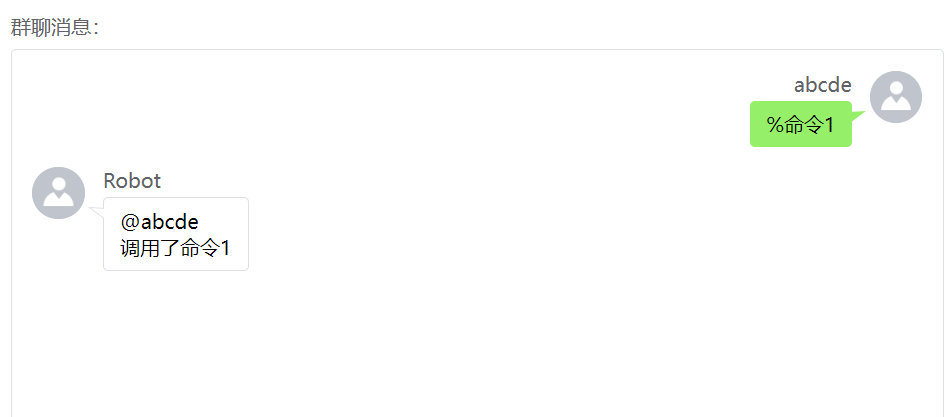

#### 无前缀命令
```java
@Command(value = "命令2", noPrefix = true)
public String command2() {
    return "调用了命令2";
}
```
调用此命令时，不需要提供命令前缀，直接发送`命令2`即可调用。

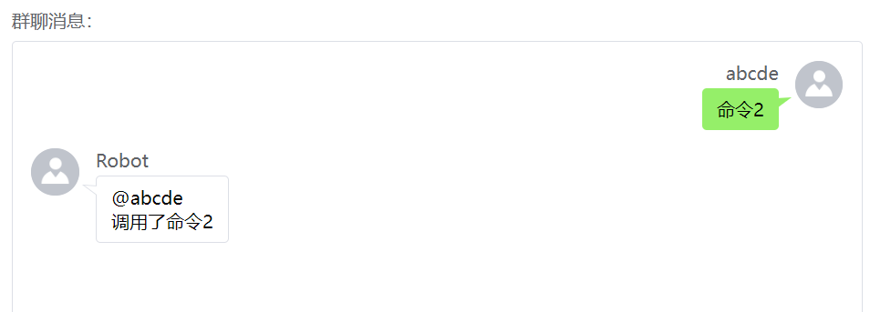

#### 管理员命令
```java
@Command(value = "命令3", admin = true)
public String command3() {
    return "调用了命令3";
}
```
只有调用者的QQ账号与Spring Boot配置项中的`honoka.qqrobot.admin-qq`所配置的QQ账号一致时，机器人才会响应此命令。

以管理员账号调用时：

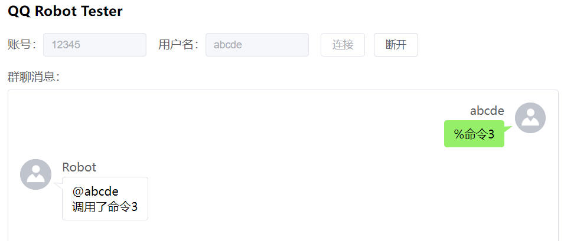

以其他账号调用时：

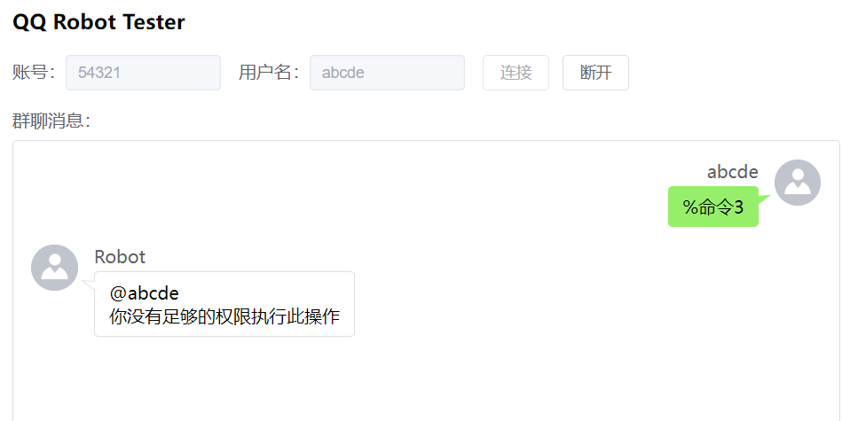

#### 回复图片的命令
```java
@Command("图片")
public RobotMessage<InputStream> image() {
    return RobotMessage.image(ImageUtils.textToImage("这是一条图片信息"));
}
```
要回复一张图片，仅需将方法返回值设为`RobotMessage<InputStream>`类型。

通过`RobotMessage.image(InputStream is)`方法，可以快速获取一个`RobotMessage<InputStream>`实例。

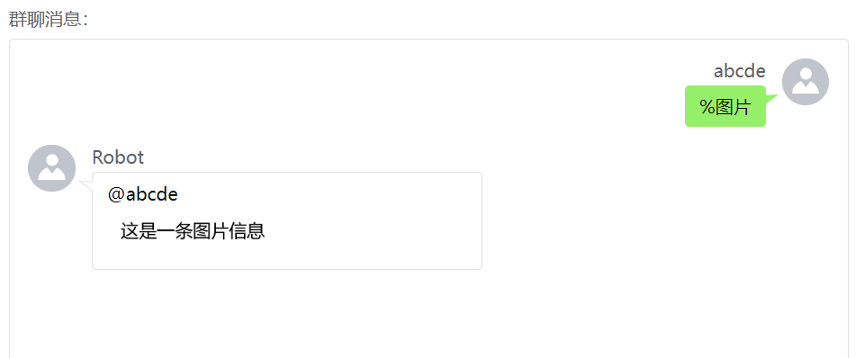

#### 回复图文混合消息的命令
```java
@Command("图文")
public RobotMultipartMessage multipartMessage() {
    RobotMultipartMessage message = new RobotMultipartMessage();
    message.add(RobotMessage.image(ImageUtils.textToImage("这是一条图片信息")));
    message.add(RobotMessage.text("这是一条文字信息"));
    return message;
}
```
要回复富文本消息，需要将返回值设定为`RobotMultipartMessage`类型。

可以创建一个`RobotMultipartMessage`的实例，然后将图片和文字按顺序添加进此实例中。

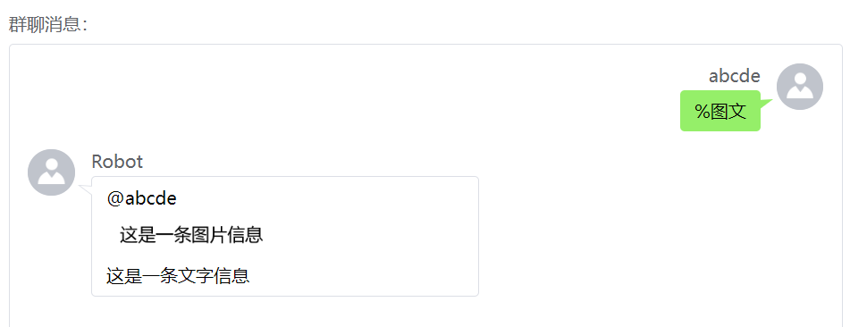

#### 单独向某个用户发送私聊消息
```java
@Resource
private Framework<?> framework;

@Command("私聊")
public void privateMsg(CommandMethodArgs args) {
    framework.sendPrivateMsg(args.getQq(), "发送私聊");
}
```
`@Command`方法的返回值设定为`void`时，机器人不会例行向消息的来源群，或来源的用户发送回复。

可以在这样的情况下，调用`Framework`类提供的方法，使某个命令总是通过私聊方式回复给调用者。

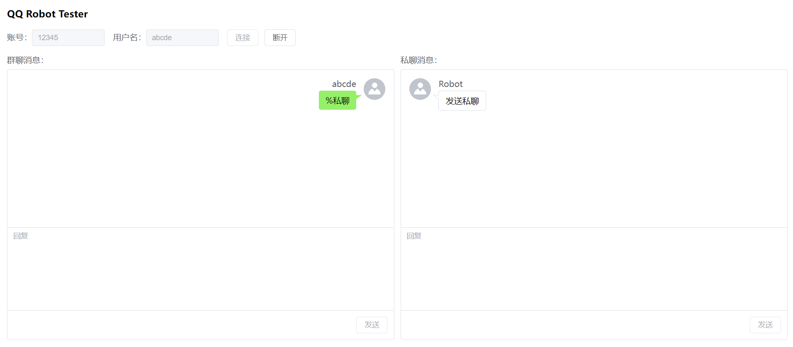

#### 将“@用户”作为参数
```java
@Command(value = "at测试", argsNum = 1)
public String atTest(CommandMethodArgs args) {
    RobotMessage<Long> at = args.getAt(0);
    String str = "qq: " + at.getContent();
    str += "\nusername: " + framework.getNickOrCard(0L, at.getContent());
    return str;
}
```
绝大多数群聊互动类功能都需要指定一个用户作为目标，而指定目标最便捷的方式就是通过`@用户`。

通过`CommandMethodArgs.getAt()`方法，可以轻松地获取到位于指定位置的`@`消息，通过`RobotMessage.getContent()`方法，可以轻松地获取到`@`消息所提到的用户的QQ号。

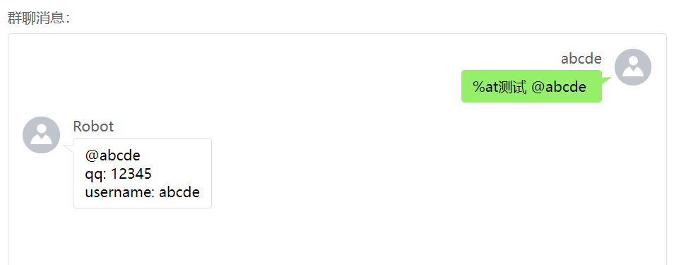

#### 会话
```java
@Resource
private SessionManager sessionManager;

@Command("会话")
public void session(CommandMethodArgs args) {
    sessionManager.openSession(args.getGroup(), args.getQq(), session -> {
        session.reply("会话已开启，现在会回复你每条消息的字符个数，" +
                "不会响应其他命令\n" +
                "输入exit退出会话，20秒内不回复自动结束会话");
        for(; ; ) {
            String str = session.waitingForReply(20)
                    .contentToString();
            if(str.trim().equals("exit")) {
                session.reply("会话退出");
                break;
            }
            session.reply("内容：" + str + "\n字符数：" + str.length());
        }
    }, session -> {
        session.reply("自定义的会话超时信息");
    });
}
```
会话是一种命令模式，指的是命令在发起后，机器人会多次要求调用者继续提供消息。

会话在开启后，机器人所收到的所有来自于调用者的消息，都会被转发到会话中，由会话中的代码进行处理。

starter提供了一种便捷的方式来处理会话，通过`SessionManager.openSession()`方法，传入会话所在的群、要进入会话的QQ账号、会话开启后要执行的代码、会话超时后要执行的代码，即可成功开启一个会话，且会话不需要手动关闭。

`RobotSession.waitingForReply()`将阻塞当前线程，直到收到来自于会话中的用户的回复，然后返回用户的回复内容，类型为`RobotMultipartMessage`。若等待超时，则抛出`RobotSession.TimeoutException`异常，然后结束会话，并执行`openSession`时提供的会话超时代码段。

会话正常结束：

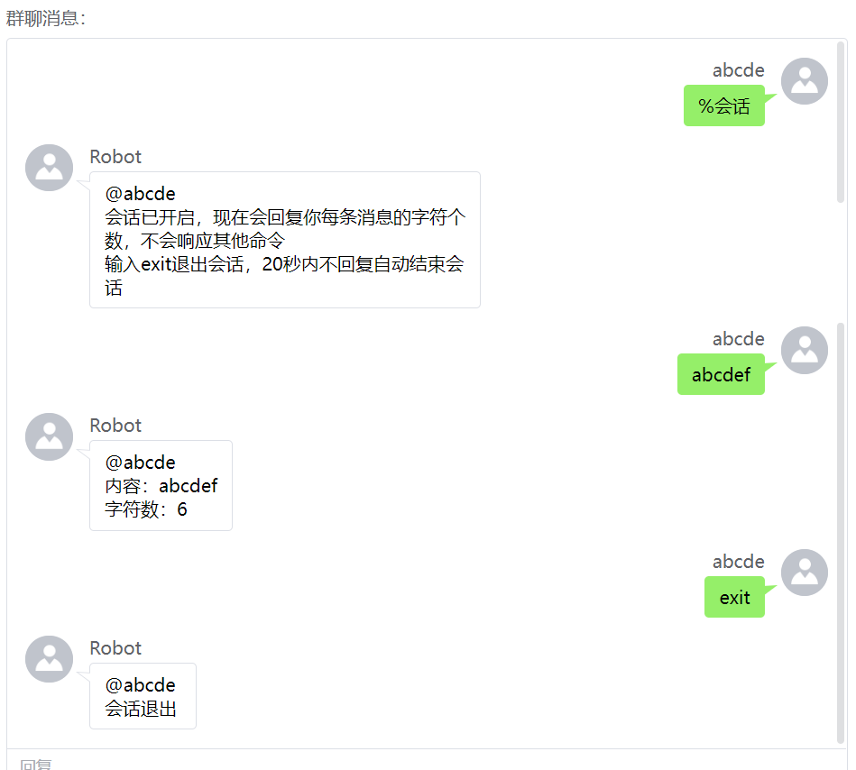

会话超时结束：

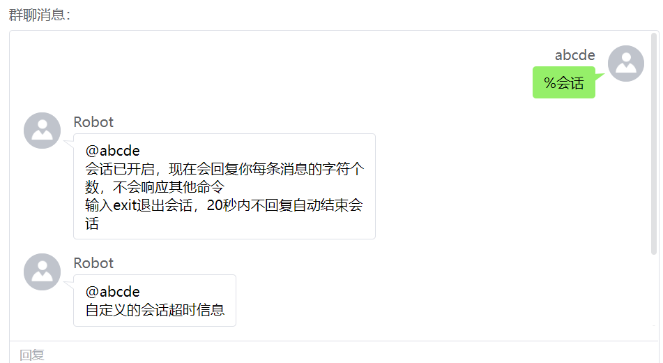

## 管理后台
starter还附带了一个通用的管理后台，可直接访问项目的Context Path来访问。

譬如，demo所监听的端口为8081，Context Path为：/qqrobot-demo，则可通过[http://localhost:8081/qqrobot-demo/](http://localhost:8081/qqrobot-demo/)来访问管理后台。

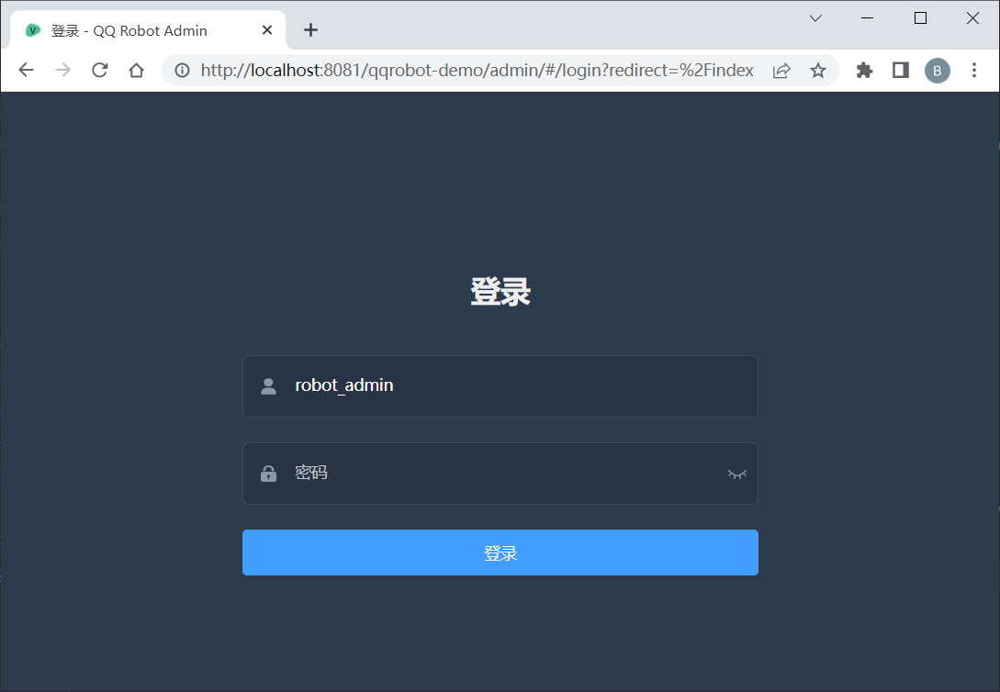

登录密码默认为`123456`，可通过`honoka.qqrobot.admin.password`配置项指定登录密码。

该后台主页包含了应用的内存占用情况、开关和一些便捷操作。

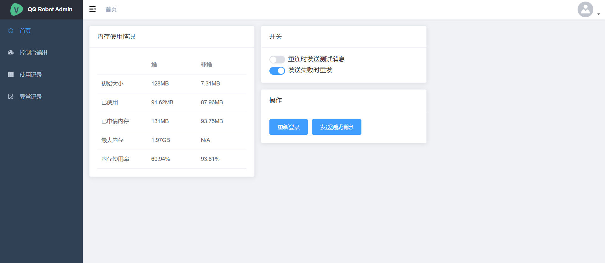

### 控制台输出
包含了应用的控制台输出内容，便于直接查看应用的运行情况。

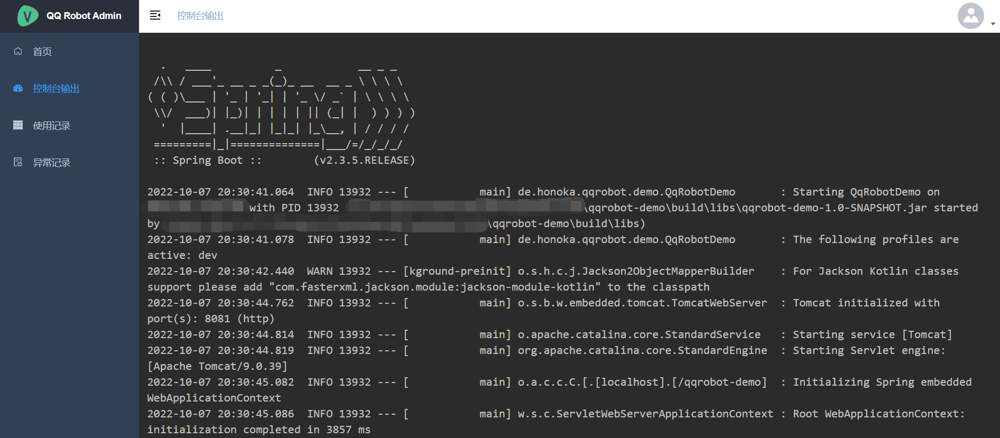

### 使用记录
包含了机器人所响应的所有命令的内容、发起者、时间和机器人的回复内容等信息。

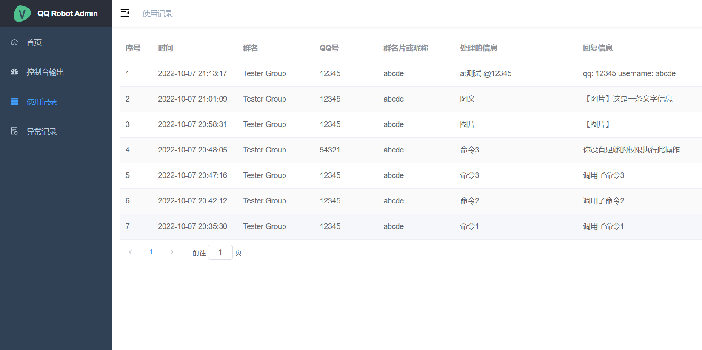

### 异常记录
当机器人在执行命令的时候，如果出现了未经处理的异常，则会首先在开发群报告此异常的堆栈信息，然后将此信息写入日志文件中。通过此页面可以查看记录的所有异常。

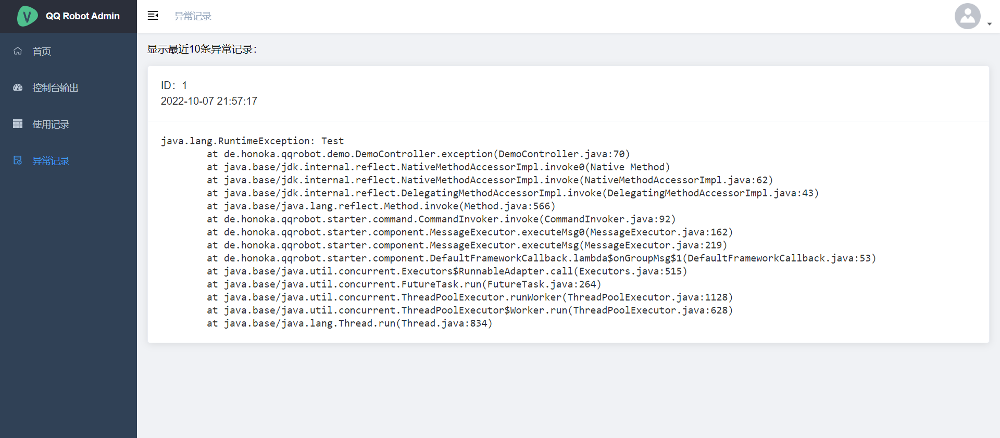
