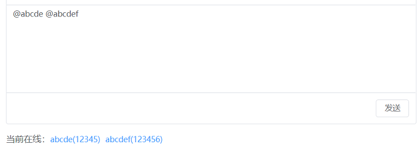
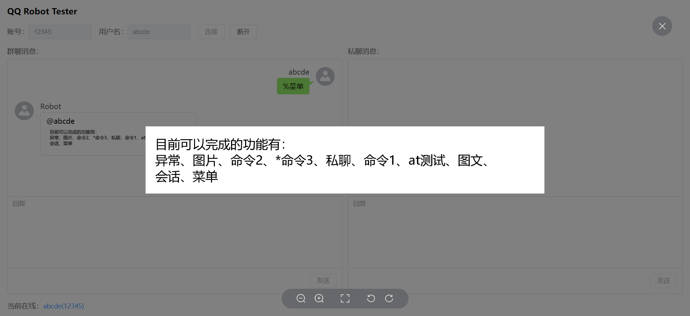

# Tester框架说明文档

## 简介
Tester框架是一个用于在不真正登录QQ账号的情况下，模拟任何QQ账号通过群聊或私聊与机器人进行交互。

其前端源代码位于[此处](../qqrobot-spring-boot-starter/web/tester)，后端源代码位于[此处](../qqrobot-spring-boot-starter/src/main/java/de/honoka/qqrobot/framework/impl/tester)。 前端与后端通过WebSocket进行通信。

支持接收机器人发送的图文信息，支持向机器人发送带`@用户`类型的参数的信息。

## 使用
### 多账号登录
Tester框架的前端页面可以同时打开多个，可以同时登录多个不同账号且不同用户名的用户。

通过界面上方的输入框可指定与机器人进行交互时要使用的QQ号及其用户名。

界面下方将显示当前在线的用户的用户名及其账号。

点击当前登录用户，可快速在群聊消息框中添加对此用户的`@`信息。

需要注意的是，`@用户`消息的格式是：`@ + 用户名 + 一个英文空格`，否则将被视为文本消息。当`@用户`消息位于整条消息的最后时，需注意必须包含尾部的空格才能成功发送`@`。

### 群聊与私聊
界面中含有两个对话框，在群聊对话框中发送出去的消息，会被机器人视为群聊消息。同理在私聊对话框中发送的消息，也会被机器人视为私聊消息。

当机器人向用户发送群聊消息时，消息会出现在群聊对话框。发送私聊消息时，消息会出现在私聊对话框。可以通过这两个对话框，模拟群聊和私聊两种情况与机器人进行交互，以及查看机器人在不同环境下的回复情况。

### 对话框中的消息提醒
对话框中偶尔会出现一些有价值的系统消息。

### 缩略图与全图
机器人发送的消息中若包含图片，则图片会以缩略图的形式展示。

点击缩略图，可以展示这张图片的原图。

